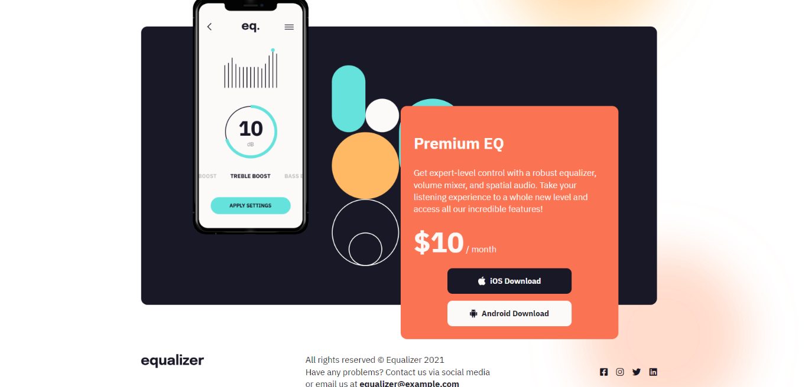

# Question 6

## Task 1
### Change logo

let logo = document.querySelector("header img");
logo.src = "./assets/ineuron-logo.png";

## Task 2
### Change Price

let appPrice = document.querySelector(".app .app_price span");
appPrice.innerText = "$10";
